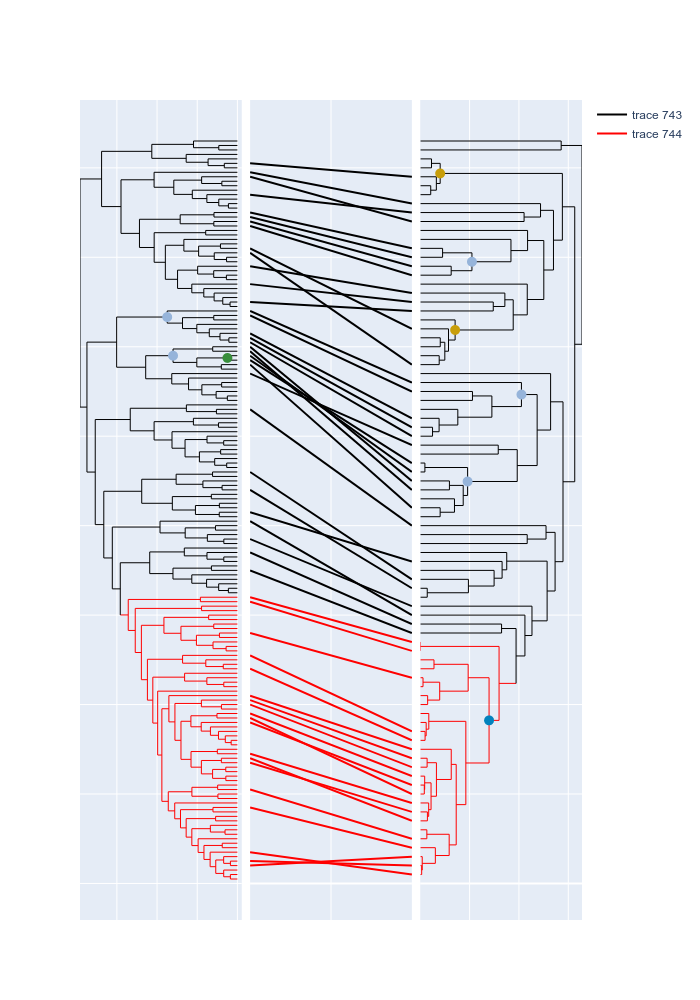

# tanglegram example

For the usage of the tanglegram function, you could refer to the following example.

```python
from ete3 import Tree
from visualization.tanglegram import *
newick1 = 'test_data/left.newick'
nw1 = Tree(newick1,3)
# actually
newick2 = 'test_data/right.newick'
nw2 = Tree(newick2,3)
n = nw2.get_common_ancestor(['IMG2513237068','GCA_000200715.1'])
n.swap_children()


l2c = {_.name:'#ff0000' for _ in left_tre.get_clade('GCF_900248165.1|GCF_000802205.1').get_terminals()}

# you could pass a parsed newick like `nw1` or raw file like `newick1` into the tanglegram file
# if you pass a parsed file, you could process it in advance. such as minor orders in `nw2` example.
fig,left_tre,right_tre = tanglegram(nw1,nw2,identical=True,l_color_setting=l2c)

# change the color of a lineage in the left tree
datas1 = [_ for _ in fig.data if _['xaxis'] == 'x']
for idx in left_tre.get_index('GCF_900248165.1','GCF_000802205.1'):
    data = datas1[idx]
    data['line']['color']='#ff0000'
    
# place some symbols on the left tree
name2color = {'Chitin':'#c89e0a',
             'Oxygen':"#96b4da",
             'lignin':"#388E3C",
              'HGT':"#0282bd"}
cal_2021 = """GCF_000023945.1|GCF_000026045.1\t<15.79\tChitin
GCF_000011185.1|GCF_000152265.2\t<23.2\tOxygen
GCF_000215995.1|GCF_000022365.1\t<15.79\tChitin
GCF_000007005.1|GCF_000213215.1\t<23.2\tOxygen
GCF_000015225.1|GCF_000015205.1\t<23.2\tOxygen
GCA_000802205.2|GCA_900143675.1\t>7.5<14.87\tHGT""".split('\n')

for row in cal_2021:
    if not row:
        pass
    group,time,name = row.split('\t')
    l1,l2 = group.split('|')
    data = right_tre.add_marker(l1,l2,style=dict(size=10,color=name2color[name]))
    data['showlegend'] = False
    fig.append_trace(data,1,3)
# change the color of a lineage in the right tree
datas2 = [_ for _ in fig.data if _['xaxis'] == 'x3']
for idx in right_tre.get_index('GCF_900248165.1','GCF_900696045.1'):
    datas2[idx]['line']['color']='#ff0000'    

# place some symbols on the left tree    
cal_2019 = """GCF_000015225.1|GCF_000018305.1\t2.33\tOxygen
GCF_000012285.1|GCA_000213215.1\t2.33\tOxygen
GCF_000007005.1|GCA_000024305.1\t0.475\tlignin""".split('\n')
for row in cal_2019:
    if not row:
        pass
    group,time,name = row.split('\t')
    l1,l2 = group.split('|')
    data = left_tre.add_marker(l1,l2,style=dict(size=10,color=name2color[name]))
    data['showlegend'] = False
    fig.append_trace(data,1,1)
    
fig.layout.height=1000    
fig.show()

```

The generated figure likes 
